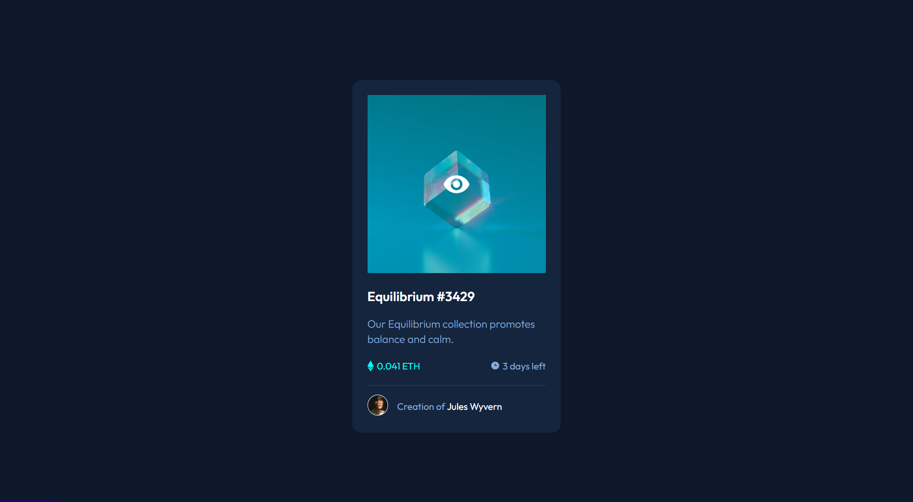
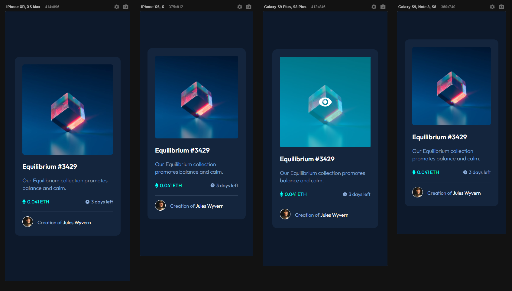

# Frontend Mentor - NFT preview card component solution

This is a solution to the [NFT preview card component challenge on Frontend Mentor](https://www.frontendmentor.io/challenges/nft-preview-card-component-SbdUL_w0U). Frontend Mentor challenges help you improve your coding skills by building realistic projects. 

## Table of contents

- [Overview](#overview)
  - [The challenge](#the-challenge)
  - [Screenshot](#screenshot)
  - [Links](#links)
- [My process](#my-process)
  - [Built with](#built-with)
  - [What I learned](#what-i-learned)
  
  
- [Author](#author)
- [Acknowledgments](#acknowledgments)


## Overview

### The challenge

Users should be able to:

- View the optimal layout depending on their device's screen size
- See hover states for interactive elements

### Screenshot

[]
[]

### Links

- Solution URL: [Soon]()
- Live Site URL: [Soon]()

## My process

### Built with

- Semantic HTML5 markup
- CSS custom properties
- Flexbox


### What I learned

This was an important project to learn more about some combined properties in css.


```css
.new-things-i-used-for-the-first-time {
  .nft-card .image-link::before{
    content: '';
    background-color: cyan;
    width: 100%;
    height: 100%;
    position: absolute;
    opacity: 0;
    transition: 0.3s ease-in-out;   
}

.nft-card .image-link::after{
    content: '';
    background: url(../images/icon-view.svg) no-repeat center;
    position: absolute;
    width: 100%;
    height: 100%;
    opacity: 0;
    transition: 0.3s ease-in-out;
}

.nft-card .image-link:hover::before
{
    opacity: 0.4;
}

.image-link:hover::after{
    opacity: 1;
}
}
```


## Author


- Frontend Mentor - [@KeeTeles](https://www.frontendmentor.io/profile/KeeTeles)


## Acknowledgments

Special thanks to DEV QUEST classes as always.
